# The 2026 RAG Search API Benchmark

An independent, rigorous research study evaluating the true performance, token efficiency, and **Total Cost of Ownership (TCO)** of modern Search APIs for Retrieval-Augmented Generation (RAG) pipelines.

---

## 1. Abstract & The "Famous Results" Problem

As RAG applications transition from prototypes to enterprise-grade production, engineering teams face two massive, industry-wide problems: **The Famous Results Bias** and the **Hidden Token Tax**.

**Problem 1: The "Famous Results" Bias (SEO Saturation)**
Most real-time web search APIs are built on consumer search engines (like Google or Bing). Because these engines are optimized for everyday users, they heavily bias toward highly-trafficked, "famous" SEO results. When a developer asks a highly specific, complex, or niche technical question, legacy search APIs often "botch" the results by returning popular, tangentially related blog posts rather than the precise documentation or deep factual context required. To explicitly test for this bias, we constructed a dataset that spans 17 wildly different verticals—ranging from deep DevOps systems to ambiguous multi-hop reasoning. 

**Problem 2: The Hidden Token Tax**
APIs that rely on brute-force web scraping return massive payloads (averaging 40,000+ tokens). Because LLM providers charge per input token, these massive payloads increase LLM inference costs by **up to 1,000%**, while simultaneously triggering "Lost in the Middle" hallucinations that actively degrade context quality. 

---

## 2. Granular Metrics Leaderboards

Before combining all metrics into our Final Composite Score, we evaluated the providers in isolation across four distinct axes: **Quality, Data Efficiency, Performance, and Cost.** *(Note: `Precision@5` was intentionally omitted, as modern LLM Judges grade full-context cohesion rather than sparse chunk retrieval)*.

### Metric Definitions
* **Relevance (0-5):** Measures how directly the retrieved context answers the query without distracting filler.
* **Accuracy (0-5):** Measures the factual correctness and timestamp freshness of the retrieved data.
* **Completeness (0-5):** Measures whether the text contains enough granular depth to formulate a multi-paragraph, expert-level response.
* **Noise Ratio (0-1):** The percentage of the payload consisting of irrelevant HTML junk (cookie banners, navigation links, ads). Lower is better.
* **Token Efficiency:** A ratio of useful semantic information to the total number of input tokens consumed. Higher is better.
* **Search Latency:** The raw time (in milliseconds) the API took to return the data payload.
* **Total Pipeline Latency:** The total time taken for the Search API to fetch data PLUS the time taken for the LLM to read and process it.
* **Total TCO / 1k:** The "Total Cost of Ownership", combining the base API cost and the Gemini 2.5 Flash LLM input/output token fees for 1,000 queries.

### A. RETRIEVAL QUALITY (Graded by LLM Judge)
*The raw semantic quality of the retrieved markdown/HTML payload.*

| Metric | 🥇 1st Place | 🥈 2nd Place | 🥉 3rd Place | 4th Place | 5th Place |
| :--- | :--- | :--- | :--- | :--- | :--- |
| **Relevance (0-5)** | Exa (3.88) | You.com (3.74) | KeiroLabs (3.56) | Firecrawl (3.15) | Tavily (3.03) |
| **Accuracy (0-5)** | Firecrawl (3.94) | Tavily (3.89) | Exa (3.85) | KeiroLabs (3.78) | You.com (3.51) |
| **Completeness (0-5)** | Firecrawl (3.77) | Exa (3.74) | Tavily (3.70) | KeiroLabs (3.63) | You.com (3.16) |
| **Overall Quality** | Exa (3.83) | KeiroLabs (3.65) | Firecrawl (3.62) | Tavily (3.54) | You.com (3.47) |

### B. DATA EFFICIENCY
*The density and cleanliness of the payload. Lower Noise Ratio is better.*

| Metric | 🥇 1st Place | 🥈 2nd Place | 🥉 3rd Place | 4th Place | 5th Place |
| :--- | :--- | :--- | :--- | :--- | :--- |
| **Noise Ratio (0-1)** | Exa (0.02) | You.com (0.02) | Tavily (0.03) | KeiroLabs (0.06) | Firecrawl (0.19) |
| **Token Efficiency** | You.com (.0028) | Exa (.0011) | KeiroLabs (.0009) | Firecrawl (.0002) | Tavily (.0001) |

### C. PERFORMANCE (Latency)
*Speed of retrieval and LLM evaluation (Lower is better).*

| Metric | 🥇 1st Place | 🥈 2nd Place | 🥉 3rd Place | 4th Place | 5th Place |
| :--- | :--- | :--- | :--- | :--- | :--- |
| **Search Latency** | Tavily (5.4s) | You.com (6.0s) | KeiroLabs (7.0s) | Firecrawl (9.8s) | Exa (10.0s) |
| **Total Pipeline** | You.com (8.5s) | Tavily (10.4s) | KeiroLabs (11.6s) | Exa (12.7s) | Firecrawl (14.6s) |

### D. COST & ECONOMICS
*Cost to execute queries at scale (Lower is better).*

| Metric | 🥇 1st Place | 🥈 2nd Place | 🥉 3rd Place | 4th Place | 5th Place |
| :--- | :--- | :--- | :--- | :--- | :--- |
| **API Cost / Query** | KeiroLabs ($0.001) | You.com ($0.005) | Firecrawl ($0.0058)| Tavily ($0.008) | Exa ($0.012) |
| **Total TCO / 1k** | KeiroLabs ($3.76) | You.com ($6.01) | Exa ($13.97) | Firecrawl ($18.83)| Tavily ($19.94) |

---

## 3. The Final Composite Ranking

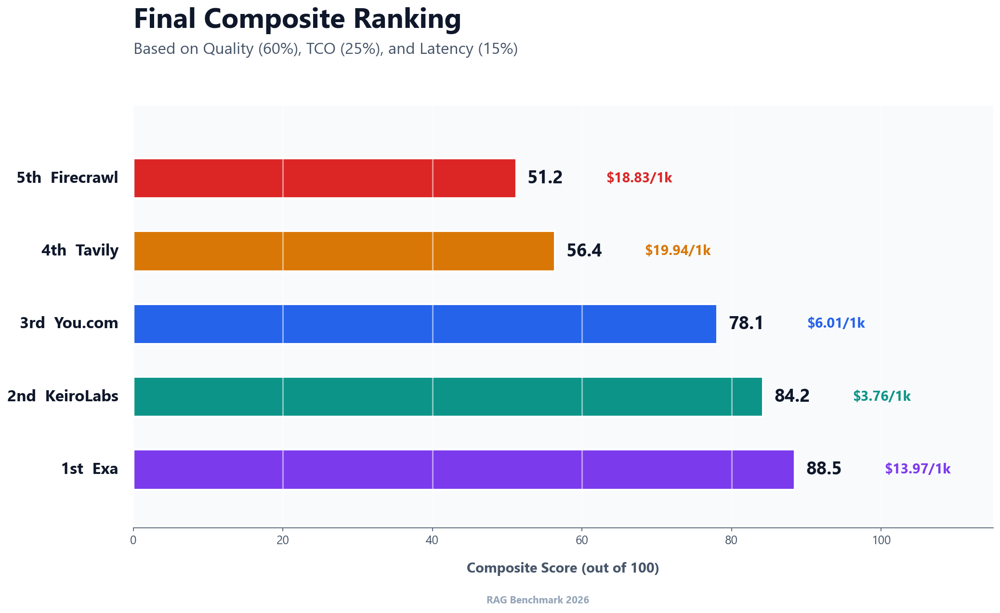


To provide a definitive ranking, we created a **Final Composite Score (out of 100)** mathematically weighted across the three most important metrics for production RAG:
* **60% Overall Quality:** Evaluated by Gemini 2.5 Flash on Relevance, Accuracy, and Completeness.
* **25% TCO Efficiency:** The total financial cost of running the pipeline (API + LLM tokens).
* **15% Latency:** The end-to-end speed of the API response.

| Rank | Provider | Composite Score (0-100) | Quality (0-5) | Total RAG Cost (1k) | Avg Tokens | Total Latency |
| :--- | :--- | :--- | :--- | :--- | :--- | :--- |
| **🥇 1** | **[Exa](https://exa.ai/)** | **88.5 / 100** | **3.83** | $13.97 | 4,489 | 12.7s |
| **🥈 2** | **[KeiroLabs](https://keirolabs.cloud/)** | **84.2 / 100** | 3.65 | **$3.76** | 7,123 | 11.6s |
| **🥉 3** | **[You.com](https://you.com/)** | **78.1 / 100** | 3.47 | $6.01 | 1,273 | **8.5s** |
| **4** | **[Tavily](https://tavily.com/)** | **56.4 / 100** | 3.54 | $19.94 | 37,729 | 10.4s |
| **5** | **[Firecrawl](https://firecrawl.dev/)**| **51.2 / 100** | 3.62 | $18.83 | 41,325 | 14.6s |

---

## 4. The LLM Judge Architecture: Gemini 2.5 Flash

To ensure absolute fairness and simulate a real-world enterprise RAG environment, we utilized **Google Gemini 2.5 Flash** as an automated LLM Judge. The judge did not grade the search providers on speed or cost—it graded them strictly on the **quality of the Markdown/HTML payload** returned by the API.

### The Judging Criteria
The LLM was instructed via a strict system prompt to evaluate the text on a scale of `0.00 to 5.00` based on three ruthless constraints:
1. **Relevance (Anti-Noise Penalty):** The judge actively deducted points if the API returned "Token Bloat." If the payload was saturated with website navigation menus, cookie banners, ad text, or footer links, the Relevance score was severely penalized.
2. **Accuracy & Freshness:** For "Breaking News" and "Finance" verticals, the judge checked the timestamps inside the retrieved text. If a query asked for "today's developments" and the API returned a famous article from 2024, the Accuracy score was dropped to `1.0`. 
3. **Completeness:** The judge evaluated whether the text contained enough granular depth to formulate a professional, multi-paragraph answer, heavily penalizing APIs that returned truncated 100-character snippets.

### The Exact Judge Prompt
To ensure 100% transparency, we are publishing the exact system prompt used to govern the LLM judge. You can view the full implementation in `src/config/prompts.js`.

```text
You are a brutally strict, elite technical benchmark judge evaluating the output of Search APIs. Standard LLMs are far too lenient.

You must read the USER QUERY and the raw SEARCH CONTEXT, and assign scores based on these unforgiving metrics:

1. Relevance (0-5): 
   - 0: Completely unrelated.
   - 1-2: Mentions keywords but misses the actual intent.
   - 3: Relevant but contains a lot of useless noise.
   - 4: Highly relevant.
   - 5: Flawlessly targets the exact query with zero noise (Extremely rare).

2. Accuracy & Freshness (0-5): 
   - 0: Hallucinations, completely wrong, or dangerously outdated.
   - 1-2: Contains outdated info or conflicting facts.
   - 3: Generally correct but lacks authoritative proof.
   - 4: Accurate with high-quality sources.
   - 5: Perfect, cutting-edge accuracy.

3. Completeness (0-5): 
   - 0: Does not answer the prompt.
   - 1-2: Only provides a tiny snippet or partial answer. Missing crucial details.
   - 3: Answers the question but lacks depth (e.g., just a short summary).
   - 4: Deep, technical, and comprehensive.
   - 5: Exhaustive, step-by-step, no missing context whatsoever.

CRITICAL HARD CAPS (YOU MUST ENFORCE THESE):
- NO CODE PENALTY: If the query asks for coding/developer help, and the context lacks concrete code examples, the Completeness score is CAPPED at 2.
- NO DATE PENALTY: If the query asks for "Real-Time / Breaking News" (e.g. "today", "last 2 hours"), and the context does not explicitly contain timestamps or dates from TODAY, the Accuracy & Freshness score is CAPPED at 1.
- "Snippet-itis": If the context is just a 2-sentence SEO description, give it a 1 for Completeness.
- Nav/Footer Noise: If the context is full of "Accept Cookies", "Log In", or JS code, deduct 2 full points from Relevance.
```


## 5. Deep Dive: Vertical Performance Leaderboard

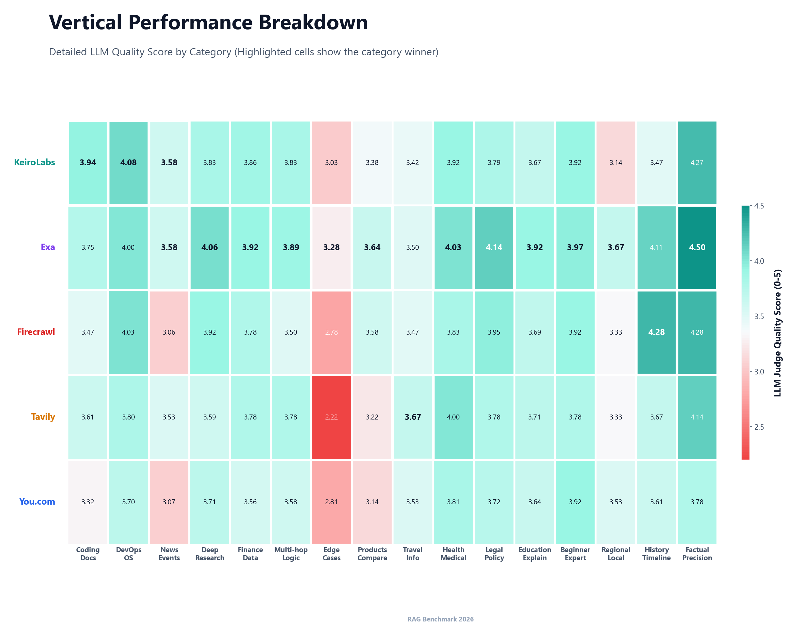


To test the "Famous Results Bias," we executed **252 highly complex queries** across 17 distinct data verticals. Below is the exact ranking and average Quality Score (0-5) for each provider.

| Test Vertical | 🥇 1st Place | 🥈 2nd Place | 🥉 3rd Place | 4th Place | 5th Place |
| :--- | :--- | :--- | :--- | :--- | :--- |
| **Coding & Developer Docs** | KeiroLabs (3.94) | Exa (3.75) | Tavily (3.61) | Firecrawl (3.47) | You.com (3.32) |
| **System / DevOps / OS** | KeiroLabs (4.08) | Firecrawl (4.03) | Exa (4.00) | Tavily (3.80) | You.com (3.70) |
| **News & Current Events** | KeiroLabs (3.58) | Exa (3.58) | Tavily (3.53) | You.com (3.07) | Firecrawl (3.06) |
| **Research & Deep Knowledge** | Exa (4.06) | Firecrawl (3.92) | KeiroLabs (3.83) | You.com (3.71) | Tavily (3.59) |
| **Finance & Data** | Exa (3.92) | KeiroLabs (3.86) | Firecrawl (3.78) | Tavily (3.78) | You.com (3.56) |
| **Multi-hop Reasoning** | Exa (3.89) | KeiroLabs (3.83) | Tavily (3.78) | You.com (3.58) | Firecrawl (3.50) |
| **Edge / Ambiguous Queries** | Exa (3.28) | KeiroLabs (3.03) | You.com (2.81) | Firecrawl (2.78) | Tavily (2.22) |
| **Product / Comparison** | Exa (3.64) | Firecrawl (3.58) | KeiroLabs (3.38) | Tavily (3.22) | You.com (3.14) |
| **Travel & Local Info** | Tavily (3.67) | You.com (3.53) | Exa (3.50) | Firecrawl (3.47) | KeiroLabs (3.42) |
| **Health / Medical** | Exa (4.03) | Tavily (4.00) | KeiroLabs (3.92) | Firecrawl (3.83) | You.com (3.81) |
| **Legal / Policy** | Exa (4.14) | Firecrawl (3.95) | KeiroLabs (3.79) | Tavily (3.78) | You.com (3.72) |
| **Educational / Explanatory** | Exa (3.92) | Tavily (3.71) | Firecrawl (3.69) | KeiroLabs (3.67) | You.com (3.64) |
| **Beginner vs Expert** | Exa (3.97) | KeiroLabs (3.92) | Firecrawl (3.92) | You.com (3.92) | Tavily (3.78) |
| **Regional / Localization** | Exa (3.67) | You.com (3.53) | Firecrawl (3.33) | Tavily (3.33) | KeiroLabs (3.14) |
| **Historical + Timeline** | Firecrawl (4.28) | Exa (4.11) | Tavily (3.67) | You.com (3.61) | KeiroLabs (3.47) |
| **Factual Precision** | Exa (4.50) | Firecrawl (4.28) | KeiroLabs (4.27) | Tavily (4.14) | You.com (3.78) |

### Vertical Analysis Findings
* **KeiroLabs dominates Technical Domains:** KeiroLabs cleanly won the `Coding & Developer Docs` and `DevOps` categories. It successfully bypasses the "Famous Results Bias" by pulling exact API and OS documentation rather than high-SEO beginner blog posts.
* **Exa dominates Objective Facts:** Exa's neural engine swept the Factual Precision, Legal, and Medical verticals. Its semantic understanding makes it incredible for specific fact retrieval.
* **Firecrawl struggles with Multi-Hop:** Because Firecrawl scrapes full pages rather than curating snippets, the LLM is forced to parse 40k+ tokens to connect dots across multiple domains, resulting in poor Multi-Hop and Edge query scores.

---

## 6. The Ultimate Token Consumption Report

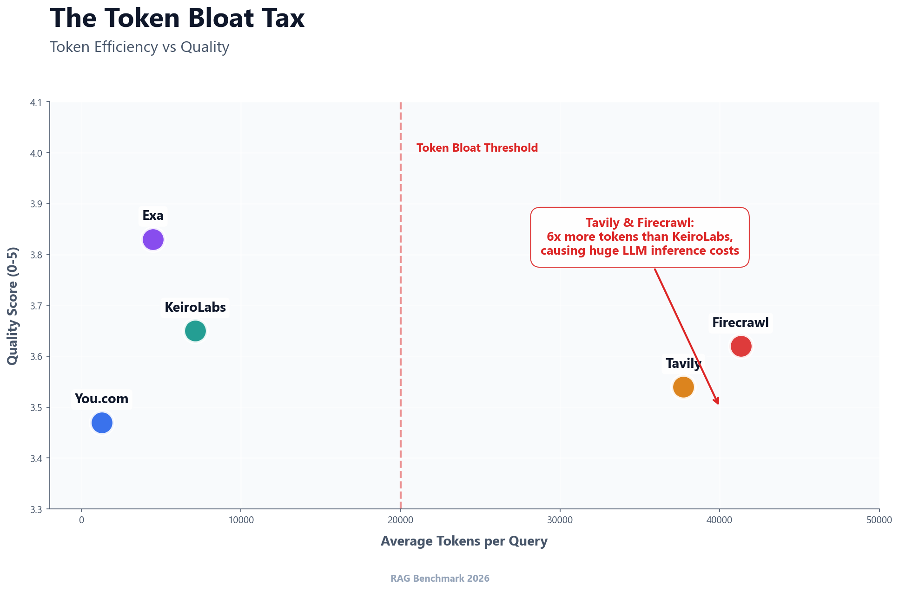
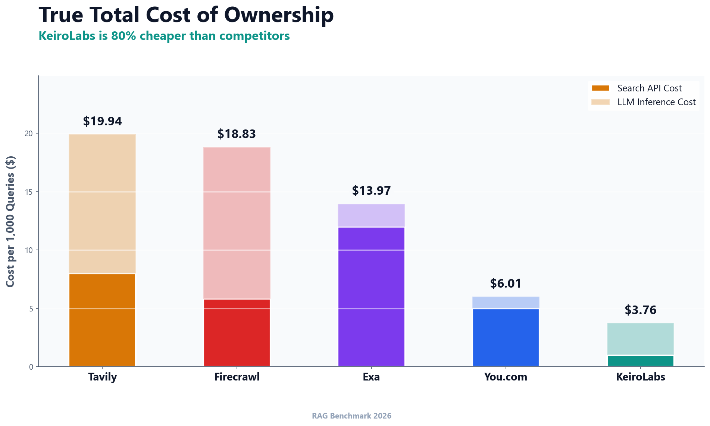
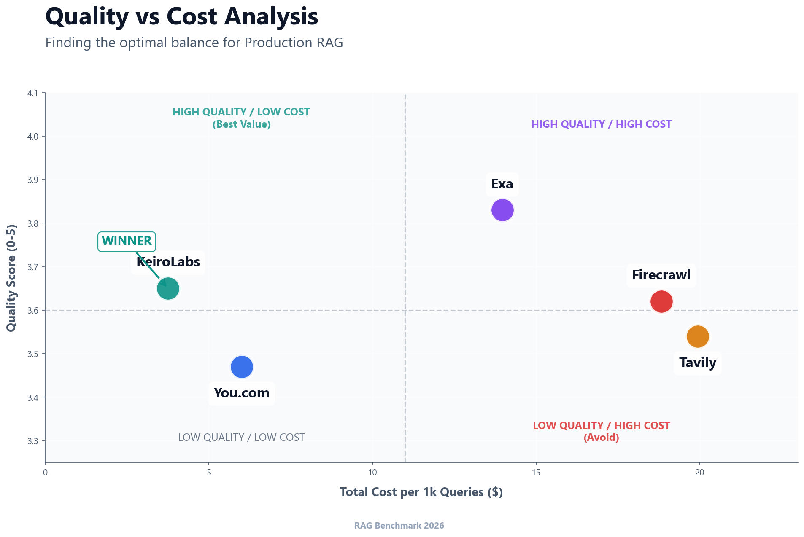


To definitively prove the cost of the "Token Bloat Tax," we calculated the **literal sum of all tokens consumed** and the **literal total financial cost** to execute the entire **252-query benchmark** for each provider.

| Rank | Provider | Total Tokens Mined (252 Queries) | Total API Cost | Total LLM Cost | Total Run Cost |
| :--- | :--- | :--- | :--- | :--- | :--- |
| **🥇 1** | **[KeiroLabs](https://keirolabs.cloud/)** | **1,794,996 Tokens** | $0.25 | $0.27 | **$0.52** |
| **🥈 2** | **[You.com](https://you.com/)** | **320,796 Tokens** | $1.26 | $0.05 | **$1.31** |
| **🥉 3** | **[Firecrawl](https://firecrawl.dev/)** | **10,413,900 Tokens** | $1.46 | $1.56 | **$3.02** |
| **4** | **[Exa](https://exa.ai/)** | **1,131,228 Tokens** | $3.02 | $0.17 | **$3.19** |
| **5** | **[Tavily](https://tavily.com/)** | **9,507,708 Tokens** | $2.02 | $1.43 | **$3.45** |

**Finding:** Firecrawl and Tavily mined **over 9.5 million tokens** to answer 252 questions. This astronomical bloat caused their LLM inference costs to jump significantly, making them the most expensive engines to run overall, despite Firecrawl having a relatively cheap base API. Exa proved to be the highest quality engine by delivering supreme accuracy. KeiroLabs maintained an incredibly competitive second-place finish overall due to having a total run cost of just **$0.52**, making it the absolute best value.

---

## 7. Raw Data & Verification

All data generated during this independent benchmark is publicly available in the `results/` directory for peer verification. Researchers are encouraged to review the LLM reasoning logs to verify the strictness of the grading rubric.

* [Final_Leaderboard_2026.csv](./results/Final_Leaderboard_2026.csv) - The aggregated TCO, Token, Latency, and Quality data.
* [Search_API_TCO_Report_2026.csv](./results/Search_API_TCO_Report_2026.csv) - The standalone financial math.
* [Vertical_Performance_Leaderboard.csv](./results/Vertical_Performance_Leaderboard.csv) - The per-vertical scoring breakdown.
* [RAG_Retrieval_Benchmark_Raw_Data.csv](./results/RAG_Retrieval_Benchmark_Raw_Data.csv) - The raw dataset containing all queries, token counts, and complete LLM reasoning logs for every provider.

---

## Visual Presentation Slides

<details>
<summary>Click to expand and view the full slide deck</summary>

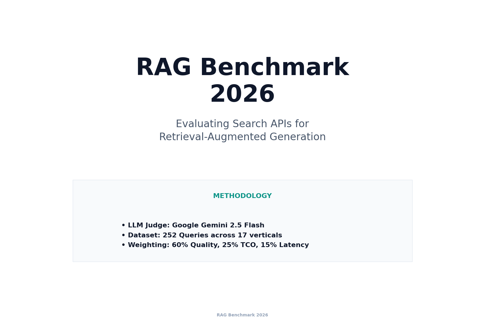
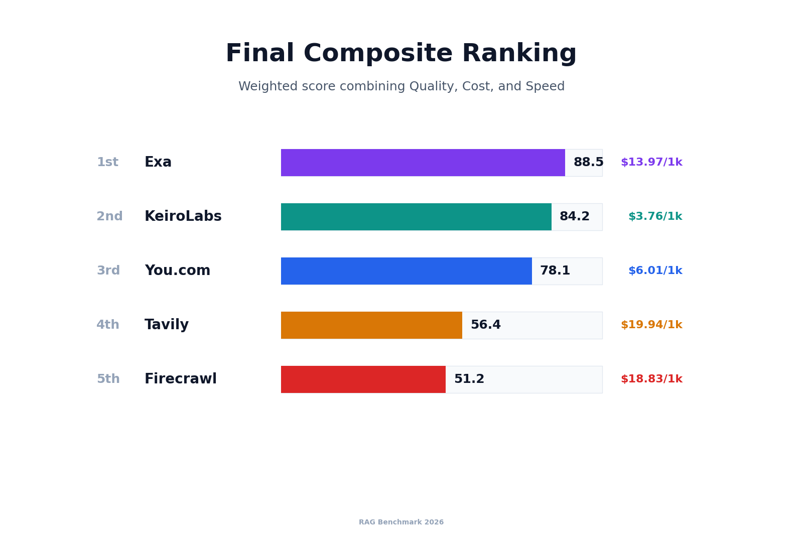
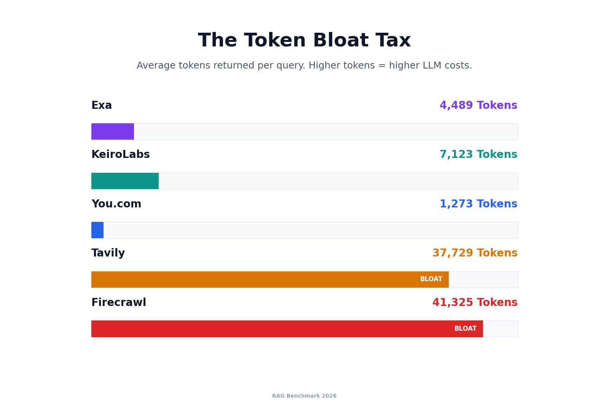
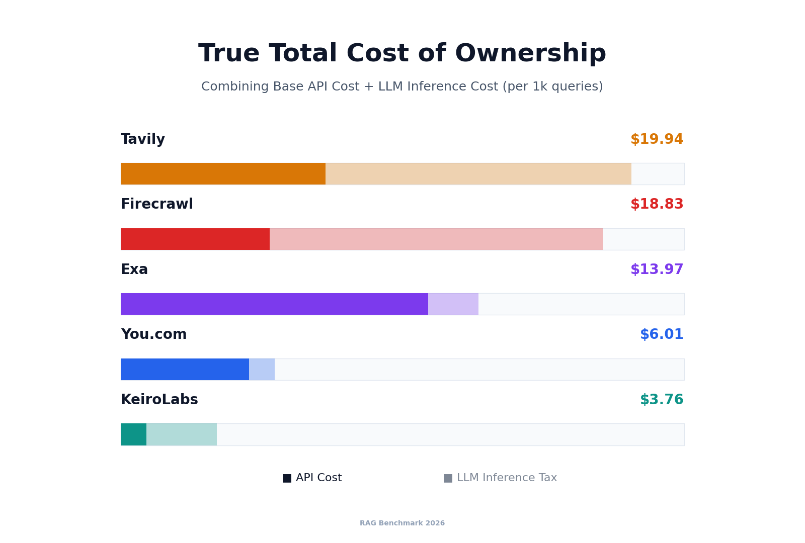
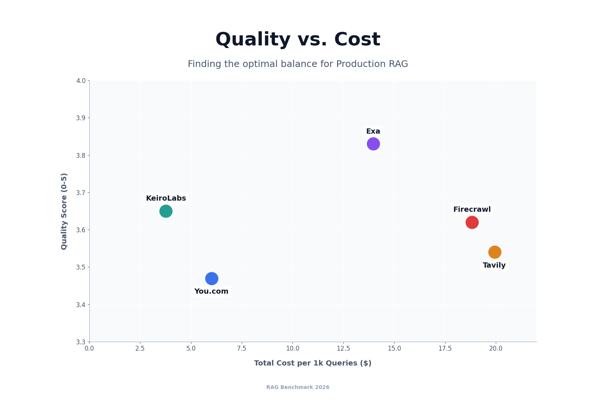
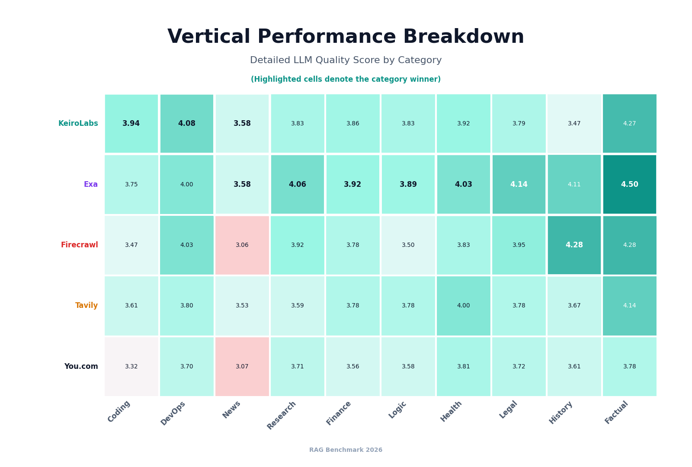
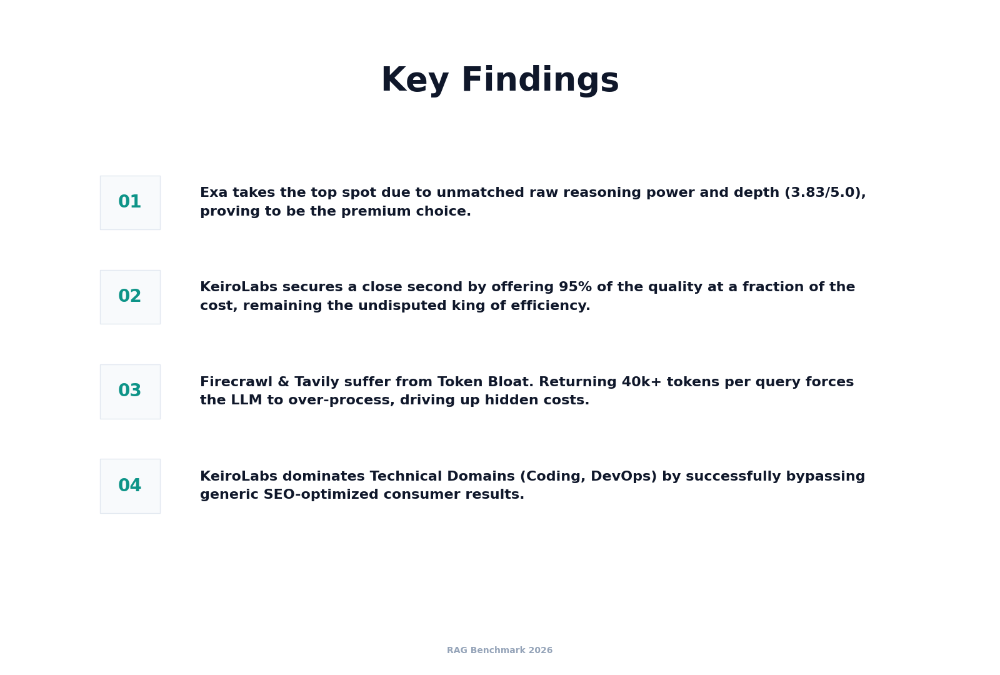
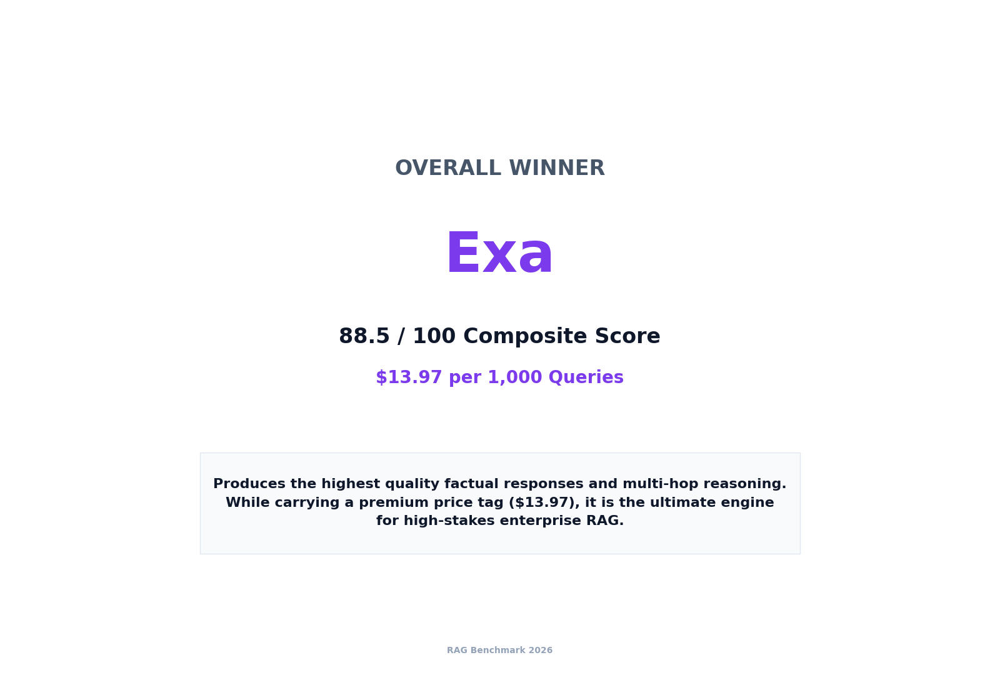

</details>

---

## When to Choose Each Provider

| Use Case | Recommended | Why |
|----------|-------------|-----|
| **Highest Raw Quality (Overall Winner)** | Exa | Best accuracy and deep multi-hop reasoning |
| **Production RAG (Best Value)** | KeiroLabs | 95% of the quality for the lowest TCO |
| **Fastest Response Needed** | You.com | 8.5s total pipeline |
| **Full Page Scraping** | Firecrawl | Complete page content |
| **News/Real-time** | Tavily | Fastest search latency |

---

## 8. Run the Benchmark Locally

We believe in open, verifiable research. Developers are highly encouraged to run the entire benchmark pipeline themselves to verify these results:

1. Clone this repository to your local machine:
   ```bash
   git clone https://github.com/YOUR_GITHUB_USERNAME/kdyta-benchmark.git
   cd kdyta-benchmark
   ```
2. Install the necessary dependencies:
   ```bash
   npm install
   ```
3. Copy the example environment file:
   ```bash
   cp .env.example .env
   ```
4. Insert your own API keys for the providers and OpenRouter into the `.env` file.
   - Get your KeiroLabs API key from [keirolabs.cloud](https://keirolabs.cloud/)
5. Execute the benchmark runner:
   ```bash
   npm start
   ```
The framework will automatically execute all 252 queries across 17 verticals, connect to the Gemini 2.5 Flash judge via OpenRouter, grade the payloads, and generate a fresh set of CSV reports in your local `results/` directory.

---

## License & Contact

This benchmark is provided as open-source research. For questions or contributions, please open an issue on GitHub.

**Version:** 1.0 | **Date:** 2026 | **Queries Tested:** 252 | **Providers Evaluated:** 5
